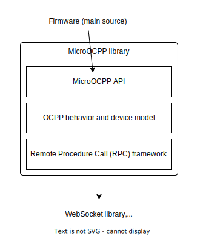

# Technical introduction

This chapter covers the technical concepts of MicroOcpp.

## Scope of MicroOcpp

The OCPP specification defines a charger data model, operations on the data model and the resulting physical behavior on the charger side. MicroOcpp implements the full scope of OCPP, i.e. a minimalistic data store for the data model, the OCPP operations and an interface to the surrounding firmware.

Another part of OCPP is its messaging mechanism, the so-called Remote Procedure Calls (RPC) framework. MicroOcpp also implements the specified RPC framework with the required guarantees of message delivery or the corresponding error handling.

At the lowest layer, OCPP relies on standard WebSockets. MicroOcpp works with any WebSocket library and has a lean interface to integrate them.

The high-level API in `MicroOcpp.h` bundles all touch points of the EVSE firmware with the OCPP library.

    
     
    <em>Overview of the architecture</em>

## High-level OCPP support

Being a full implementation of OCPP, MicroOcpp handles the OCPP communication, i.e. it sends OCPP requests and processes incoming OCPP requests autonomously. The messages are triggered by the internal data model and by input from the high-level API. Incoming OCPP requests are used to update the internal data model and if an action on the charger is required, the library signals that to the main firmware through the high-level API.

In consequence, the high-level API decouples the main firmware from the OCPP communication and hides the operations. This has the following good reasons:

- The high-level API guarantees correctnes of the OCPP integration. As soon as the charger adopts it properly, it is fully OCPP-compliant
- The hardware-near design decreases the integration effort into the firmware hugely
- The API won't change substantially for the OCPP 2.0.1 upgrade. The EVSE will get OCPP 2.0.1 support on the fly by a later firmware update

## Customizability

One core principle of the architecture of MicroOcpp is the customizability and the selective usage of its components.

Selective usage of components means that the EVSE firmware can use parts of MicroOcpp and work with its own implementation for the rest. In that case only the selected parts of MicroOcpp will be compiled into the firmware. For example, the main firmware can use the RPC framework and build a custom implementation of the OCPP logic on top of it. This could be necessary if the OCPP behavior should be tightly coupled to other modules of the firmware. In a different scenario, the EVSE firmware could already contain an extensive RPC framework and the OCPP client should reuse it. Then, only the business logic and high-level API are of interest.

    
     
    <em>Selective usage of MicroOcpp</em>

Customizations of the library allow to integrate use cases for which the high-level API is too restrictive. The high-level API is designed to provide a facade for the expected usage of the library, but since the charging sector is driven by innovation, new use cases for OCPP emerge every day. If a custom use case cannot be integrated on the API level, the main firmware can access the internal data structures of MicroOcpp and complement the required functionality or replace parts of the internal behavior with custom implementations which fits the concrete scenarios better.

## Main-loop paradigm

MicroOcpp works with the common main-loop execution model of microcontrollers. After initialization, the EVSE firmware most likely enters a main-loop and repeats it infinitely. To run MicroOcpp, a call to its loop function must be placed into the main loop of the firmware. Then at each main-loop iteration, MicroOcpp executes its internal routines, i.e. it processes input data, updates its data model, executes operations and creates new output data. The MicroOcpp loop function does not block the main loop but executes immediately. This library does not contain any delay functions. Some activities of the library spread over many loop iterations like the start of a charging session which needs to await the approval of an NFC card and a hardware diagnosis of the high power electronics for example. All activities in MicroOcpp support the distribution over many loop calls, leading to a pseudo-parallel execution behavior.

No separate RTOS task is needed and MicroOcpp does not have an internal mechanism for multi-task synchronization. However, it is of course possible to create a dedicated OCPP task, as long as extra care is taken of the synchronization.

## How the API works

The high-level API consists of four parts:

- **Library lifecycle**: The library has initialize functions with a few initialization options. Dynamic system components like the WebSocket adapter need to be set at initialization time. The deinitialize function reverts the library into an unitialized state. That's useful for memory inspection tools like valgrind or to disable the OCPP communication. The loop function also counts as part of the lifecycle management.
- **Sensor Inputs**: EVSEs are mechanical systems with a variety of sensor information. OCPP is used to send parts of the sensor readings to the server. The other part of the sensor data flows into the local charger model of MicroOcpp where it is further processed. To update MicroOcpp with the input data from the sensors, the firmware needs to bind the sensors to the library. An *Input-binding*, or in short *Input*, is a function which transfers the current sensor value to MicroOcpp. Inputs are callback functions which read a specific sensor value and pass the value in the return statement. The firmware defines those callback functions for each sensor and adds them to MicroOcpp during initialization. After initialization, MicroOcpp uses the callbacks and executes them to fetch the most recent sensor values.  
This concept is reused for the data *Outputs* of the library to the firmware, where the callback applies output data from MicroOcpp to the firmware.
- **Transaction management**: OCPP considers EVSEs as vending machines. To enable payment processing and the billing of the EVSE usage, all charging activity is assigned to transactions. A big portion of OCPP is about transactions, their prerequisites, runtime and their termination scenarios. The MicroOcpp API breaks transactions down into an initiation and termination function and gives a transparent view on the current process status, authorization result and offline behavior strategy. For non-commercial setups, the transaction mechanism is the same but has only informational purposes.
- **Device management**: MicroOcpp implements the OCPP side of the device management operations. For the actual execution, the firmware needs to provide the charger-side implementations of the operations to MicroOcpp by passing handler functions to the API. For example, the OCPP server can restart the charger. Upon receipt of the request, MicroOcpp terminates the transactions and eventually triggers the system restart using the handler function which the firmware has provided through the high-level API.

## Transaction safety

Software in EVSEs needs to withstand hazardous operating conditions. EVSEs are located on the street or in garages where the WiFi or LTE signal strength is often weak, leading to long offline periods or where random power cuts can occur. In addition to that, the lack of process virtualization on microcontrollers means that a malfunction in one part of the firmware leads to the crash of all other parts.

The transaction process of MicroOcpp is robust against random failures or resets. A minimal transaction log on the flash storage ensures that each operation on a transaction is fully executed. It will always result in a consistent state between the EVSE and the OCPP server, even over resets of the microcontroller. The RPC queue facilitates this by tracking the delivery status of relevant messages. If the microcontroller is reset while the delivery status of a message is unknown, MicroOcpp takes up the message delivery again at the next start up and completes it.

A requirement for the transaction safety feature is the availability of a journaling file system. Examples include LittleFS, SPIFFS and the POSIX file API, but some microcontroller platforms don't support this natively, so an extension would be required.

## Unit testing

MicroOcpp includes a number of unit tests based on the [Catch2](https://github.com/catchorg/Catch2) framework. A [GitHub Action](https://github.com/matth-x/MicroOcpp/actions) runs the unit tests against each new commit in the MicroOcpp repository, which ensures that new features don't break old code.

The scope of the unit tests is to to ensure a correct implementation of OCPP and to validate the high-level API against its definition. For that, it is not necessary to establish an actual test connection to an OCPP server. In fact, real-world communication would disturb the tests and make them undeterministic. That's why the test suite is fully based on an integrated, tiny OCPP test server which the OCPP client reaches over a loopback connection. The test suite does not access the WebSocket library. When making the unit tests of the main firmware, it is not necessary to check the full OCPP communication, but only to validate correct usage of the high-level API. An example of how the library can be initialized with a loopback connection can be found in its test suite.

## Microcontroller optimization

As a library for microcontrollers, the design of MicroOcpp considers the strict memory limits and complies with the best practices of embedded software development. Also, a few measures were taken to optimize the memory usage which include the spare inclusion of external libraries, an optimization of the internal data structures and the exclusion of C++ run-time type information (RTTI) and exceptions. Features of C++ which may have a larger footprint are carefully used such as the standard template library (STL) and lambda functions. The STL increases the robustness of the code and lambdas prove to be a powerful tool to deal with the complexity of asynchronous data processing in embedded systems. That's also why the high-level API has many functional parameters.

Because of the high importance of C in the embedded world, MicroOcpp provides its high-level API in C too. It is typically simple to instruct the compiler to compile and link the C++-based library in a C-based firmware development. In case that the firmware requires custom features which are not part of the C-API, then the firmware can implement it in a new C++ source file, export the new functions to the C namespace and use it normally in the main source.

While memory constraints are of concern, the execution time generally is not. OCPP is rather uncomplex on the algorithmic side for clients, since there is no need for elaborate planning algorithms or complex data transformations.

Low resource requirements also allow new usage areas on top of EV charging. For example, MicroOcpp has been ported to ordinary IoT equipment such as Wi-Fi sockets to integrate further electric devices into OCPP networks.

Although MicroOcpp is optimized for the usage on microcontrollers, it is also suitable for embedded Linux systems. With more memory available, the upper limits of the internal data structures can be increased, leading to a more versatile support of charging use cases. Also, the separation of the charger firmware into multiple processes can lead to more robustness. MicroOcpp can be extended by an inter-process communication (IPC) interface to run in a separate process.
